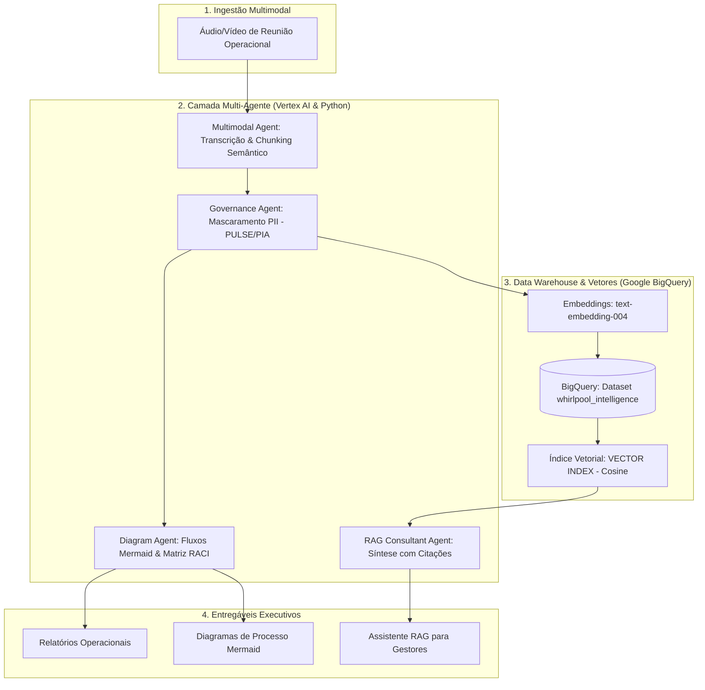

# Whirlpool AI Operations Hub 🚀
### Multi-Agent Intelligence, BigQuery Vector Search & Governance (Vertex AI)

> Projeto desenvolvido sob medida para os requisitos da posição de **AI Analyst (Information Systems)** da **Whirlpool Corporation**, demonstrando na prática o desenvolvimento e implantação de soluções de IA Generativa, agentes autônomos/colaborativos, pipelines no BigQuery e governança corporativa de dados.

---

## 📌 Visão Geral & Casos de Uso de Negócio

Nas operações industriais e corporativas da Whirlpool (com unidades de referência em **Rio Claro-SP**, **Joinville-SC** e sede administrativa no **Sacomã-SP**), equipes de **Logística, Manufatura, Engenharia, Finanças e Qualidade** realizam reuniões críticas diariamente para resolver gargalos da cadeia de suprimentos e melhoria contínua de produtos (linhas **Brastemp** e **Consul**).

O **Whirlpool AI Operations Hub** automatiza o ciclo completo de inteligência sobre essas operações:
1. **Ingestão Multimodal:** Processa gravações de áudio/vídeo e atas de reuniões usando modelos **Gemini no Vertex AI**.
2. **Governança & Privacidade (PULSE / PIA / LGPD):** Identifica e mascara automaticamente dados sensíveis (PII, CPFs, matrículas funcionais e contatos) antes de qualquer persistência no Data Warehouse.
3. **Pipeline de Dados & BigQuery Vector Search:** Gera embeddings via `text-embedding-004`, persiste os dados tratados no BigQuery e cria índices vetoriais nativos (`VECTOR INDEX`) com métrica de similaridade de cosseno.
4. **Agente Modelador de Processos:** Transforma discussões operacionais em **fluxogramas executáveis em Mermaid.js** e gera **Matrizes RACI** de responsabilidade.
5. **Agente Consultivo RAG:** Permite que diretores e gestores façam perguntas em linguagem natural diretamente no terminal ou em notebooks, obtendo respostas fundamentadas com citações exatas de falantes, datas e atas.

---

## 🏛️ Arquitetura da Solução



---

## 🛠️ Tecnologias Utilizadas

- **Linguagem:** Python 3.13
- **Plataforma de Nuvem:** Google Cloud Platform (GCP)
- **Vertex AI:** 
  - `gemini-2.5-flash` para transcrição multimodal, raciocínio e síntese.
  - `text-embedding-004` para vetorização semântica (768 dimensões).
  - SDK unificado oficial: `google-genai`.
- **Google BigQuery:** 
  - Armazenamento em Data Warehouse estruturado.
  - Indexação vetorial nativa: `CREATE VECTOR INDEX ... OPTIONS(distance_type='COSINE', index_type='IVF')`.
  - Busca semântica vetorial em SQL nativo: função `VECTOR_SEARCH()`.
- **Governança & Segurança:** 
  - Autenticação corporativa via **Application Default Credentials (ADC)**.
  - Mascaramento e auditoria em conformidade com o comitê de governança **PULSE** e **PIA (Privacy Impact Assessment)**.
- **Visualização:** Mermaid.js e Jupyter Notebook.

---

## 📂 Estrutura do Repositório

## 🌐 Interface Web: Whirlpool AI Operations Portal

O projeto inclui uma aplicação web corporativa completa em **HTML5, CSS3 e JavaScript**, integrada ao backend **FastAPI**:

- **Gravação Direta pelo Navegador:** O colaborador grava o relato diretamente pelo microfone com um clique (usando a API nativa `MediaRecorder`).
- **Upload / Drag & Drop:** Suporte a arquivos `.m4a`, `.mp3`, `.wav`, `.mp4`.
- **Renderização Visual de Diagramas:** Fluxogramas operacionais desenhados em tempo real na tela com **Mermaid.js**.
- **Compartilhamento 1-Clique:**
  - 🟢 **WhatsApp:** Gera link direto com o resumo e plano de ação pré-formatado para encaminhar a stakeholders.
  - ✉️ **E-mail:** Cria rascunho de e-mail com a ata executiva e status da governança.
  - 📋 **Copiar Relatório / Baixar Markdown.**
- **Chat RAG Integrado:** Barra interativa de perguntas e respostas conectada ao BigQuery Vector Search.

```
whirlpool-ai-hub/
├── frontend/                  # Aplicação Web (HTML5/CSS3/JS/Mermaid.js)
│   ├── index.html             # Interface do Portal do Colaborador
│   ├── css/style.css          # Estilização no Design System Whirlpool
│   └── js/app.js              # Gravação de microfone, render Mermaid e API fetch
├── src/
│   ├── api/
│   │   └── server.py          # Backend REST em FastAPI com CORS e Swagger docs
│   ├── agents/                # Agentes Multimodal, Governança, Diagramas e RAG
│   ├── pipeline/              # Ingestão BigQuery e Embeddings
│   └── utils/                 # Conexão GCP
├── run_app.py                 # Inicializador 1-clique do servidor web
├── main.py                    # Script de execução em lote / CLI
└── README.md
```

---

## 🚀 Como Executar o Projeto

### 1. Iniciar o Portal Web (Interface Completa)
```bash
python run_app.py
```
O navegador abrirá automaticamente em `http://127.0.0.1:8000`.  
A documentação interativa da API estará disponível em `http://127.0.0.1:8000/docs`.

### 2. Execução em Lote via Terminal (CLI)
```bash
python main.py
```

### 3. Publicação no GitHub Pages & Cloud Run
- **Frontend (GitHub Pages):** A pasta `frontend/` pode ser publicada diretamente no GitHub Pages como site estático. Para apontar para um backend em nuvem, basta alterar a constante `API_BASE` em `frontend/js/app.js`.
- **Backend (Google Cloud Run):** O servidor FastAPI pode ser implantado no Cloud Run com um único comando serverless:
  ```bash
  gcloud run deploy whirlpool-ai-api --source . --region us-central1 --allow-unauthenticated
  ```

---

## 💰 Considerações de FinOps & Custos

- **BigQuery:** Utilização do modelo *Serverless*. Dentro do Free Tier mensal do Google Cloud (1 TB de processamento de queries e 10 GB de armazenamento).
- **Vertex AI:** Uso otimizado do modelo `gemini-2.5-flash` e `text-embedding-004`. O custo para processar dezenas de reuniões completas é inferior a **R\$ 0,20**, totalmente coberto pelos créditos de teste do GCP.
- **Segurança:** Autenticação via ADC sem exposição de chaves estáticas de Service Account.
