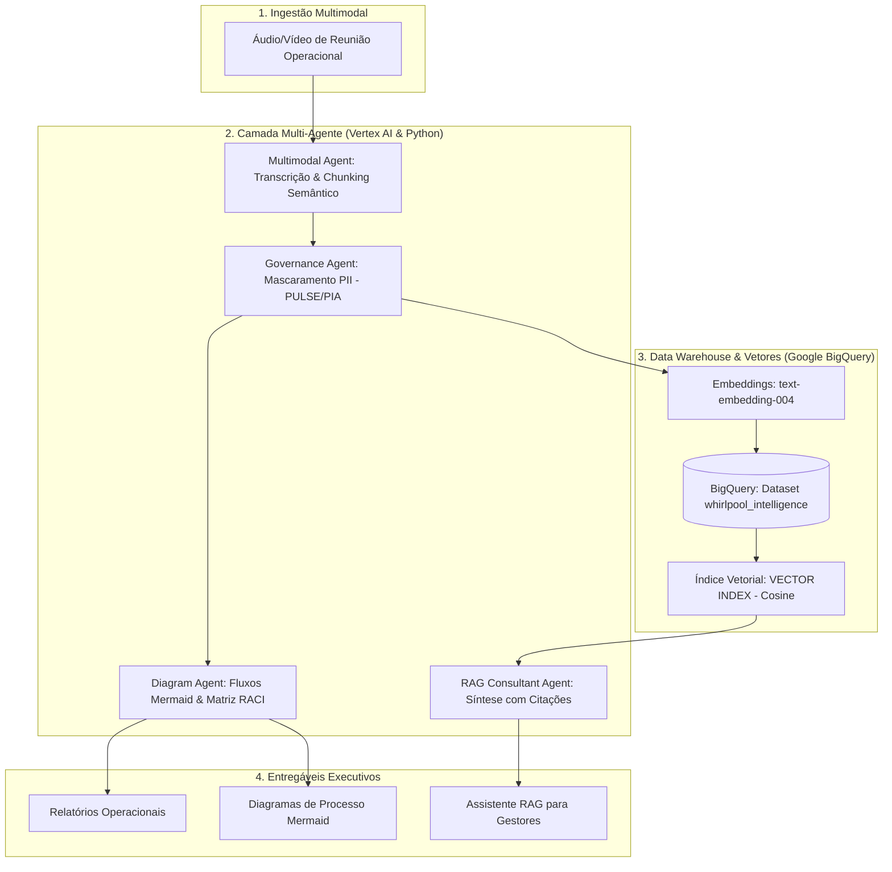
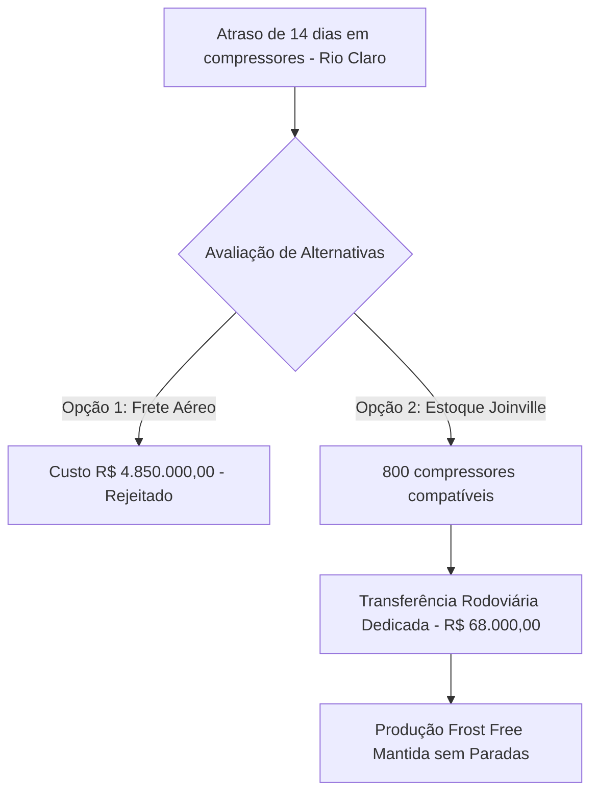

# Whirlpool AI Operations Hub 🚀
### Multi-Agent Intelligence, BigQuery Vector Search & Governance (Vertex AI)

> Projeto desenvolvido sob medida para os requisitos da posição de **AI Analyst (Information Systems)** da **Whirlpool Corporation**, demonstrando na prática o desenvolvimento e implantação de soluções de IA Generativa, agentes autônomos/colaborativos, pipelines no BigQuery e governança corporativa de dados.

---

## 📌 Visão Geral & Casos de Uso de Negócio

Nas operações industriais e corporativas da Whirlpool (com unidades de referência em **Rio Claro-SP**, **Joinville-SC** e sede administrativa no **Sacomã-SP**), equipes de **Logística, Manufatura, Engenharia, Finanças e Qualidade** realizam reuniões críticas diariamente para resolver gargalos da cadeia de suprimentos e melhoria contínua de produtos (linhas **Brastemp** e **Consul**).

O **Whirlpool AI Operations Hub** automatiza o ciclo completo de inteligência sobre essas operações:
1. **Ingestão Multimodal:** Processa gravações de áudio/vídeo e atas de reuniões usando modelos **Gemini no Vertex AI**.
2. **Governança & Privacidade (PULSE / PIA / LGPD):** Identifica e mascara automaticamente dados sensíveis (PII, CPFs, matrículas funcionais e contatos) antes de qualquer persistência no Data Warehouse.
3. **Pipeline de Dados & BigQuery Vector Search:** Gera embeddings via `text-embedding-004`, persiste os dados tratados no BigQuery e cria índices vetoriais nativos (`VECTOR INDEX`) com métrica de similaridade de cosseno.
4. **Agente Modelador de Processos:** Transforma discussões operacionais em **fluxogramas executáveis em Mermaid.js** e gera **Matrizes RACI** de responsabilidade.
5. **Agente Consultivo RAG:** Permite que diretores e gestores façam perguntas em linguagem natural diretamente no terminal ou em notebooks, obtendo respostas fundamentadas com citações exatas de falantes, datas e atas.

---

## 🏛️ Arquitetura da Solução



---

## 🛠️ Tecnologias Utilizadas

- **Linguagem:** Python 3.13
- **Plataforma de Nuvem:** Google Cloud Platform (GCP)
- **Vertex AI:** 
  - `gemini-2.5-flash` para transcrição multimodal, raciocínio e síntese.
  - `text-embedding-004` para vetorização semântica (768 dimensões).
  - SDK unificado oficial: `google-genai`.
- **Google BigQuery:** 
  - Armazenamento em Data Warehouse estruturado.
  - Indexação vetorial nativa: `CREATE VECTOR INDEX ... OPTIONS(distance_type='COSINE', index_type='IVF')`.
  - Busca semântica vetorial em SQL nativo: função `VECTOR_SEARCH()`.
- **Governança & Segurança:** 
  - Autenticação corporativa via **Application Default Credentials (ADC)**.
  - Mascaramento e auditoria em conformidade com o comitê de governança **PULSE** e **PIA (Privacy Impact Assessment)**.
- **Visualização:** Mermaid.js e Jupyter Notebook.

---

## 📂 Estrutura do Repositório

```
whirlpool-ai-hub/
├── data/
│   ├── sample_meetings.py     # Dados sintéticos de cenários reais Whirlpool
│   ├── raw_audio/             # Diretório para áudios/vídeos das reuniões
│   └── sanitized/             # Transcrições pós-governança
├── src/
│   ├── agents/
│   │   ├── multimodal_agent.py# Ingestão e segmentação multimodal (Gemini)
│   │   ├── governance_agent.py# Sanitização e auditoria de PII (PULSE/PIA)
│   │   ├── diagram_agent.py   # Geração de fluxogramas Mermaid e Matriz RACI
│   │   └── rag_agent.py       # Assistente de busca vetorial no BigQuery
│   ├── pipeline/
│   │   ├── embeddings.py      # Geração de vetores com text-embedding-004
│   │   └── bigquery_loader.py # Schema, VECTOR INDEX e consultas SQL
│   └── utils/
│       └── gcp_client.py      # Gerenciamento seguro de conexões GCP
├── reports/                   # Relatórios executivos e diagramas gerados
├── notebooks/
│   └── demo_walkthrough.ipynb # Demonstração interativa passo a passo
├── main.py                    # Script de orquestração ponta a ponta
├── requirements.txt           # Dependências do projeto
└── README.md
```

---

## 🚀 Como Executar o Projeto

### 1. Pré-requisitos
- Python 3.10+ instalado.
- Conta no Google Cloud com projeto ativo e APIs ativadas (`Vertex AI`, `BigQuery`).
- Google Cloud CLI autenticado com Application Default Credentials:
  ```bash
  gcloud auth application-default login
  gcloud auth application-default set-quota-project SEU_PROJECT_ID
  ```

### 2. Configuração do Ambiente Virtual
```bash
# Clone ou acesse o repositório
cd whirlpool-ai-hub

# Crie e ative o ambiente virtual
python -m venv .venv
.\.venv\Scripts\Activate.ps1    # No Windows PowerShell
source .venv/bin/activate       # No Linux/Mac

# Instale as dependências
pip install -r requirements.txt
```

### 3. Variáveis de Ambiente
Crie um arquivo `.env` na raiz do projeto:
```env
GCP_PROJECT_ID=seu-project-id
GCP_LOCATION=us-central1
BIGQUERY_DATASET=whirlpool_intelligence
BIGQUERY_TABLE=meeting_knowledge_base
EMBEDDING_MODEL=text-embedding-004
GEMINI_MODEL=gemini-2.5-flash
```

### 4. Execução Ponta a Ponta
Para executar todo o pipeline (Governança $\to$ Ingestão $\to$ BigQuery Vector Search $\to$ Diagramas $\to$ Consultas RAG):
```bash
python main.py
```

---

## 📊 Demonstração dos Resultados

### 1. Auditoria de Governança de Dados (Compliance Whirlpool PULSE)
```text
Métricas de Mascaramento:
- CPFs removidos: 1
- Matrículas funcionais protegidas: 1
- Telefones mascarados: 1
Status: APPROVED_PULSE_PIA
```

### 2. Fluxograma de Decisão Operacional Gerado (Mermaid.js)


### 3. Consulta Semântica RAG (BigQuery Vector Search)
> **Pergunta:** *"O que a equipe de logística decidiu sobre os atrasos de compressores na fábrica de Rio Claro e qual o valor economizado?"*  
> **Resposta:** *"Conforme alinhamento conduzido por Carlos Silva (Gerente de Logística) e Roberto Souza (Engenharia de Produção), foi decidida a transferência imediata de 800 compressores de segunda geração do armazém de Joinville para a fábrica de Rio Claro via frete rodoviário dedicado no valor de R\$ 68.000,00. Essa decisão evitou a contratação de frete aéreo emergencial cotado em R\$ 4.850.000,00, gerando uma economia de mais de R\$ 4,78 milhões e evitando a paralisação da linha de refrigeradores Frost Free Brastemp."*  
> **Fontes Citadas:** *Dataset BigQuery `whirlpool_intelligence.meeting_knowledge_base` (Score de similaridade: 0.884).*

---

## 💰 Considerações de FinOps & Custos

- **BigQuery:** Utilização do modelo *Serverless*. Dentro do Free Tier mensal do Google Cloud (1 TB de processamento de queries e 10 GB de armazenamento).
- **Vertex AI:** Uso otimizado do modelo `gemini-2.5-flash` e `text-embedding-004`. O custo para processar dezenas de reuniões completas é inferior a **R\$ 0,20**, totalmente coberto pelos créditos de teste do GCP.
- **Segurança:** Autenticação via ADC sem exposição de chaves estáticas de Service Account.
