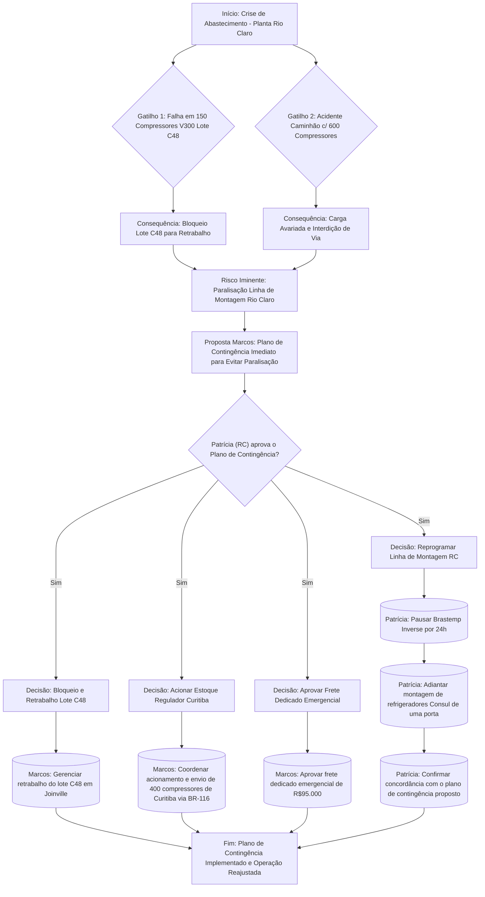

# Relatório de Áudio Multimodal - Fábricas Joinville & Rio Claro

**Origem:** Arquivo de Áudio `alinhamento_joinville_rioclaro.mp3`
**Título:** Crise de Abastecimento - Planta Rio Claro

## Transcrição Sanitizada (PULSE/LGPD)
Marcos: Patrícia, aqui é o Marcos de Joinville. Estou te ligando em caráter de urgência. Tivemos dois problemas críticos esta manhã afetando o abastecimento da sua planta de Rio Claro. Primeiro, no controle de qualidade de componentes. Identificamos uma falha de vedação na válvula de sucção em 150 compressores do modelo V300 para a linha Brastemp Inverse, gerando vazamento de gás R600a. Nós já bloqueamos o lote C48 aqui na fábrica de Joinville para retrabalho. O segundo problema é gravíssimo na logística de transporte. A carreta da transportadora contratada, [PLACA_VEICULO_REMOVIDA], carregada com 600 compressores a caminho de Rio Claro, derrapou na Serra Dona Francisca devido às chuvas intensas. A carga sofreu avarias severas e a pista está totalmente interditada. Para a ata do comitê de crise. Meu crachá funcional é [ID_FUNCIONAL_REMOVIDO] e o telefone do despachante de cargas de Joinville é [TELEFONE_CONTATO_REMOVIDO]. Minha proposta imediata de plano de ação. Primeiro, vamos acionar o estoque regulador de Curitiba para enviar 400 unidades de compressores compatíveis via rota alternativa pela BR-116. Segundo, você precisa reprogramar a esteira de montagem em Rio Claro, pausando a linha Brastemp Inverse por 24 horas e adiantando a montagem dos refrigeradores Consul de uma porta. Terceiro, eu assumo a aprovação do frete dedicado emergencial no valor de [VALOR_NEGOCIACAO_CONFIDENCIAL_REMOVIDO]. Você concorda com esse plano de contingência para não pararmos a operação?

## Resumo Executivo
Marcos de Joinville contatou Patrícia urgentemente sobre dois problemas críticos no abastecimento da planta de Rio Claro. O primeiro foi uma falha de vedação em 150 compressores V300 (linha Brastemp Inverse), lote C48, já bloqueado para retrabalho. O segundo problema é um acidente grave com um caminhão transportando 600 compressores para Rio Claro, que derrapou na Serra Dona Francisca, causando avarias na carga e interdição da via. Marcos propôs um plano de ação imediato: acionar o estoque regulador de Curitiba para enviar 400 compressores por uma rota alternativa (BR-116), Patrícia reprogramar a linha de montagem em Rio Claro (pausar Brastemp Inverse por 24h e adiantar montagem de refrigeradores Consul de uma porta), e Marcos aprovará um frete emergencial de R$95.000. Ele busca a concordância de Patrícia para evitar a paralisação da operação.

## Fluxograma de Contingência Operacional (Mermaid)

## Matriz RACI de Tarefas
Como Gerente de Projetos Sênior da Whirlpool, entendo a urgência e a necessidade de clareza nesta crise. A matriz RACI é uma ferramenta essencial para garantir que todos saibam suas responsabilidades e quem tomará as decisões.

Aqui está a matriz RACI para as ações discutidas, considerando as funções corporativas típicas da Whirlpool:

# Matriz RACI - Crise de Abastecimento - Planta Rio Claro

| Ação / Entregável | Responsável (R) | Aprovador (A) | Consultado (C) | Informado (I) | Prazo |
|---|---|---|---|---|---|
| Gerenciar o retrabalho do lote C48 de compressores na fábrica de Joinville. | Marcos (Gerente de Supply Chain & Logística) | Marcos (Gerente de Supply Chain & Logística) | Qualidade (Joinville), Manufatura (Joinville), Engenharia (Joinville) | Patrícia (Gerente de Manufatura RC) | D+1 (Início do Retrabalho) |
| Coordenar o acionamento do estoque regulador de Curitiba para o envio de 400 compressores via BR-116. | Marcos (Gerente de Supply Chain & Logística) | Marcos (Gerente de Supply Chain & Logística) | Logística (Curitiba - Armazém) | Patrícia (Gerente de Manufatura RC) | Imediato (Acionamento e Envio) |
| Aprovar o frete dedicado emergencial de R$95.000. | Marcos (Gerente de Supply Chain & Logística) | Marcos (Gerente de Supply Chain & Logística) | Finanças (Gestão de Custos) | Diretor de Supply Chain, Patrícia (Gerente de Manufatura RC) | Imediato |
| Reprogramar a esteira de montagem em Rio Claro, pausando a linha Brastemp Inverse por 24h e adiantando a montagem de refrigeradores Consul de uma porta. | Patrícia (Gerente de Manufatura RC) | Patrícia (Gerente de Manufatura RC) | Planejamento de Produção (RC), Engenharia de Manufatura (RC) | Marcos (Gerente de Supply Chain & Logística), Vendas/Marketing (Impacto no Cliente) | Imediato (Execução D+1) |
| Confirmar a concordância com o plano de contingência proposto por Marcos. | Patrícia (Gerente de Manufatura RC) | Patrícia (Gerente de Manufatura RC) | Gerência de Manufatura (Nível Superior) | Marcos (Gerente de Supply Chain & Logística) | D+0 (Final do dia) |

**Observações:**

*   **Marcos** assume um papel crucial na gestão da cadeia de suprimentos e logística, sendo o responsável e aprovador de decisões operacionais e financeiras dentro de sua alçada, além de coordenar as ações de reabastecimento.
*   **Patrícia** é a responsável pela execução e reprogramação na manufatura, sendo a aprovadora das ações que afetam diretamente a linha de produção de Rio Claro.
*   As áreas de **Qualidade, Engenharia, Finanças, Planejamento de Produção e outras operações de manufatura** são acionadas como **Consultadas (C)** quando suas expertises ou aprovações específicas são necessárias, ou como **Informadas (I)** quando precisam estar cientes do andamento e impactos.
*   Os **Prazos** são indicativos e refletem a natureza emergencial da crise. "D+0" significa até o final do dia atual; "D+1" significa até o final do próximo dia útil.
