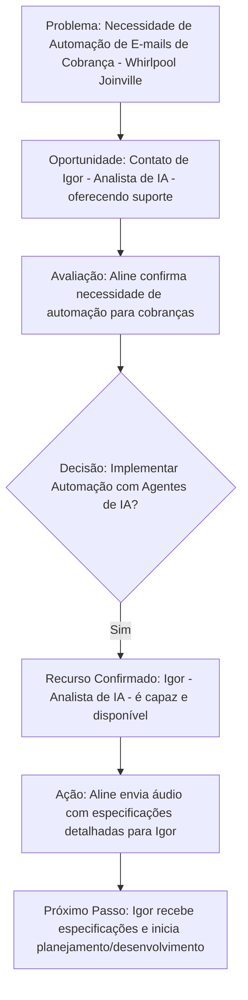

# Relatório Operacional - Áudio: igor_audio_real.m4a

**Título:** Prospecção de Automação com IA para Cobranças Whirlpool
**Departamento:** Inovação e Automação de Processos | **Data:** 2026-09-03

## Transcrição Sanitizada (PULSE/LGPD)
Boa tarde, Aline, tudo bem com você? Aqui quem fala é o Igor, com CRA de 1132448. Ah, estou, é, apresentando algo, acabei de ser contratado como analista de IA, e estou verificando se os times da Whirlpool precisa de algum, algum auxílio para fazer aplicações de automações usando agentes de IA. Fico no aguardo, se você precisar, você pode entrar em contato comigo pelo meu e-mail, igor@whirlpool.br.

Olá Igor, aqui é a Aline de CRA 428820, e sim, a gente está precisando de, de criar algumas automações, ah, usando agentes de IA, principalmente para o envio de e-mails para os nossos clientes, fazendo cobranças. Será que você poderia fazer, é, você poderia fazer essas automações para o nosso time work in Joinville?

Perfeito, Aline, muito obrigado pelo seu contato. Claro, é super viável fazer essas automações. Eu preciso só que você encaminhe para mim um áudio especificando todas as necessidades da equipe no meu e-mail. Fico no aguardo, muito obrigado.

## Resumo Executivo
Igor, um recém-contratado analista de IA da Whirlpool (CRA 1132448), entrou em contato com Aline (CRA 428820) para oferecer suporte em automações com agentes de IA. Aline confirmou a necessidade de tais automações, especificamente para o envio de e-mails de cobrança para clientes, para a equipe de Joinville. Igor confirmou a viabilidade do projeto e solicitou que Aline enviasse um áudio detalhando as necessidades específicas da equipe.

## Fluxograma de Processo (Mermaid)

## Matriz RACI de Responsabilidades
Excelente! Como Gerente de Projetos Sênior na Whirlpool, entendo a importância de clareza e responsabilidade. Vamos estruturar essa ação na matriz RACI, considerando as funções típicas em uma empresa como a nossa.

A reunião "Prospecção de Automação com IA para Cobranças Whirlpool" indica que o contexto é a área de Finanças, especificamente Cobranças, e busca soluções de TI/Automação.

Aqui está a matriz RACI para a ação fornecida:

---

### Matriz RACI para Ação da Reunião 'Prospecção de Automação com IA para Cobranças Whirlpool'

| Ação / Entregável                                                         | Responsável (R) | Aprovador (A)                                   | Consultado (C)          | Informado (I)                           | Prazo                         |
| :------------------------------------------------------------------------ | :-------------- | :---------------------------------------------- | :---------------------- | :-------------------------------------- | :---------------------------- |
| Encaminhar áudio com especificações de automação detalhadas para Igor     | Aline           | Aline (validado pelo Gerente de Cobranças)      | Equipe de Cobranças     | Gerente Financeiro (Setor de Cobranças) | 3 dias úteis após a reunião   |

---

**Justificativa das atribuições:**

*   **Responsável (R) - Aline:** A descrição da ação indica claramente que Aline é a executora da tarefa de encaminhar o áudio.
*   **Aprovador (A) - Aline (validado pelo Gerente de Cobranças):** Embora Aline seja responsável por compilar e enviar as especificações, a natureza "detalhada das necessidades de automação" sugere que o conteúdo do áudio, que representa os requisitos do negócio, deve ter a aprovação ou validação final do seu superior direto ou do líder funcional da área de Cobranças. Assumo que Aline esteja na área de Finanças/Cobranças.
*   **Consultado (C) - Equipe de Cobranças:** Para que Aline consiga detalhar as necessidades de automação, ela certamente precisaria consultar os membros da equipe de Cobranças que vivenciam os processos diários e os pontos de dor, garantindo que as especificações sejam precisas e completas.
*   **Informado (I) - Gerente Financeiro (Setor de Cobranças):** O Gerente Financeiro da área de Cobranças (ou um equivalente sênior) precisaria ser informado de que as especificações iniciais foram encaminhadas para avaliação, pois essa é uma etapa crucial na prospecção de uma solução que impactará sua área.
*   **Prazo - 3 dias úteis após a reunião:** Enviar um áudio é uma tarefa que pode ser concluída rapidamente, especialmente se as especificações já foram discutidas. Um prazo de 3 dias úteis dá tempo suficiente para Aline organizar e enviar o material sem causar atrasos no início da análise de Igor.
