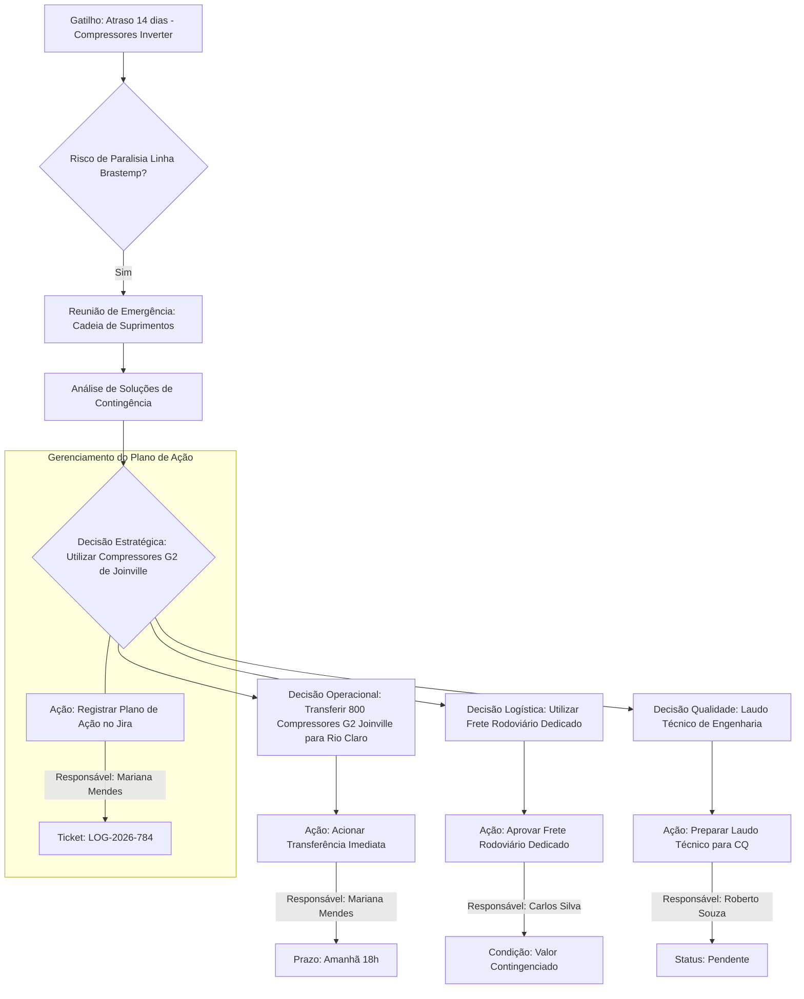

# Relatório de Inteligência Operacional - Whirlpool

**Reunião:** Alinhamento Operacional: Cadeia de Suprimentos e Compressores - Linha Brastemp
**Departamento:** Logística e Manufatura | **Data:** 2026-08-15

## Resumo Executivo
A reunião de emergência abordou o atraso de 14 dias em um lote de compressores inverter para a planta de Rio Claro, com risco de paralisia na linha de montagem de refrigeradores Brastemp. Uma solução foi encontrada para utilizar compressores de segunda geração disponíveis em Joinville, evitando a interrupção da produção. Decisões incluíram a transferência imediata via frete rodoviário e a preparação de documentação técnica.

## Fluxograma Operacional do Processo (Mermaid)

## Matriz de Governança de Tarefas (RACI)
Como Gerente de Projetos Sênior da Whirlpool, é crucial ter clareza nas responsabilidades para garantir a execução eficiente e pontual das ações.

Abaixo, apresento a Matriz RACI para as ações discutidas, alinhada com as funções corporativas e a dinâmica da Whirlpool:

# Matriz RACI: Alinhamento Operacional - Cadeia de Suprimentos e Compressores

| Ação / Entregável | Responsável (R) | Aprovador (A) | Consultado (C) | Informado (I) | Prazo |
|---|---|---|---|---|---|
| Acionar a transferência imediata de 800 compressores de Joinville para Rio Claro | Mariana Mendes | Carlos Silva | Roberto Souza | - | amanhã às 18h |
| Preparar o laudo técnico da engenharia para o controle de qualidade | Roberto Souza | Roberto Souza | Mariana Mendes | Carlos Silva | - |
| Aprovar o frete rodoviário dedicado no valor contingenciado | Carlos Silva | Carlos Silva | Mariana Mendes | Roberto Souza | - |
| Registrar o plano de ação no Jira corporativo sob o ticket LOG-2026-784 | Mariana Mendes | Carlos Silva | - | Roberto Souza | - |

**Justificativas para as atribuições:**

*   **Acionar transferência de compressores:**
    *   **R: Mariana Mendes (Suprimentos):** É a responsável por coordenar a movimentação de materiais e fornecedores, ativando a logística.
    *   **A: Carlos Silva (Logística):** Gerente de Logística, ele é o responsável final pela aprovação e sucesso de uma transferência crítica de grande volume.
    *   **C: Roberto Souza (Engenharia):** Pode ser consultado sobre as especificações técnicas dos compressores ou condições de transporte/recebimento para garantir a integridade do produto.
*   **Preparar laudo técnico:**
    *   **R: Roberto Souza (Engenharia):** Como engenheiro, ele é o especialista e o executor direto da preparação do laudo.
    *   **A: Roberto Souza (Engenharia):** Em casos de laudos técnicos específicos de sua área, o próprio responsável pela elaboração é também o aprovador de seu conteúdo técnico.
    *   **C: Mariana Mendes (Suprimentos):** A cadeia de suprimentos precisa entender as implicações do laudo para futuras aquisições ou tratamento de materiais.
    *   **I: Carlos Silva (Logística):** Para ciência de qualquer impacto na movimentação ou armazenamento de itens relacionados.
*   **Aprovar frete rodoviário dedicado:**
    *   **R: Carlos Silva (Logística):** Como Gerente de Logística, a aprovação de fretes e custos logísticos está sob sua alçada direta.
    *   **A: Carlos Silva (Logística):** Ele é o responsável por esta decisão e suas implicações orçamentárias dentro da área.
    *   **C: Mariana Mendes (Suprimentos):** Ela é a "cliente" interna que demanda o frete (para a transferência dos compressores) e deve ser consultada sobre a adequação e urgência do serviço.
    *   **I: Roberto Souza (Engenharia):** Para que esteja ciente de que a solução de transporte para os compressores está sendo encaminhada.
*   **Registrar plano de ação no Jira:**
    *   **R: Mariana Mendes (Suprimentos):** É a executora da tarefa administrativa de registro.
    *   **A: Carlos Silva (Logística):** O ticket é `LOG-`, indicando que o plano de ação é de Logística, tornando o Gerente de Logística o responsável final pela conformidade e execução do plano.
    *   **C: -** Para a *ação de registrar*, não há necessidade de consulta de especialistas do grupo listado. O *conteúdo* do plano de ação, sim, pode ter envolvido consultas prévias.
    *   **I: Roberto Souza (Engenharia):** Todos os envolvidos nas ações devem ser informados que o plano foi formalmente registrado e é acompanhado.

Esta matriz servirá como uma ferramenta clara para a gestão e acompanhamento das tarefas, garantindo que cada um saiba seu papel e responsabilidade no processo.
